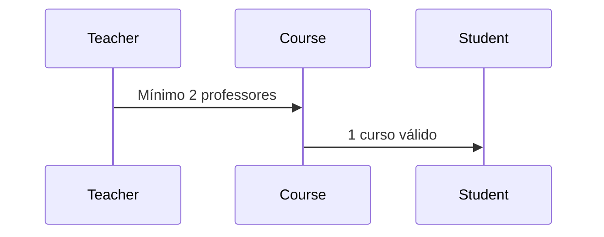

# Sandbox Trainee Prominas 				

## José Júlio Alves Campolina
Sandbox with the aim of improving knowledge about **web development** using mainly **NodeJS** and **MongoDB**

# Files
## app.js
app.js is the project's base file. It is responsible for connecting to the database and managing the routes for each resource

## database.js
File connection to the **mongodb database**.

## controller/
Folder containing the request **control** files. It validates the required attributes using 'joi validate' and forwards the requests to the **model**.

## model/
Folder containing resource **models**. It validates the business rules and contains the connection to the **database**.

## routes/
Folder containing the **routes** for each of the **http requests** (get, post, put, delete).

## test/
Folder containing the **test** files for each of the resource **requests**. The tests uses **mocha** and **chai**.

## Resources

Resource|   Fields                                               |
|----------------|----------------|
|User|`'name, lastName & profile'` |           
|Teacher|`'name, lastName & phd'` |
|Course|`'name, period, city and Teacher'` |
|Student|`'name, lastName, age and Course'`| 

## Propagation

In this project, there is the propagation of data between resources. Courses contains Teachers and Students contains Courses

